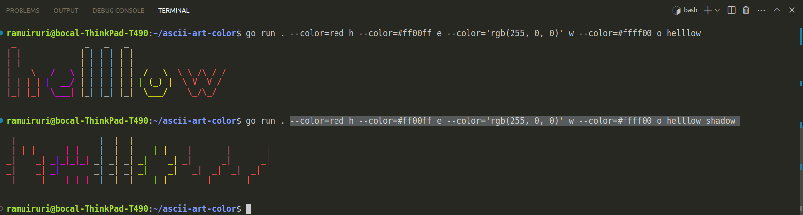

## Description

Ascii-art is a program that receives a string as an argument and displays the string in a graphic representation using ASCII.

## Authors

- [x] [najwang](https://learn.zone01kisumu.ke/git/najwang)
- [x] [ramuiruri](https://learn.zone01kisumu.ke/git/ramuiruri)
- [x] [dochiel](https://learn.zone01kisumu.ke/git/dochiel)
## Features
   Supports:
   1.color
   2.output
   3.justify
   4.fs
## Usage: how to use the program

Assuming the current working directory, is set to the repository's root:

1. Displaying the ASCII graphics of the text `Hello` using the default `standard` banner:
   
   ```shell
   ascii-art-color$ go run . "Hello"
    _    _          _   _          
   | |  | |        | | | |         
   | |__| |   ___  | | | |   ___   
   |  __  |  / _ \ | | | |  / _ \  
   | |  | | |  __/ | | | | | (_) | 
   |_|  |_|  \___| |_| |_|  \___/  
                                   
                                   
   ascii-art-color$
   ```

2. Displaying the ASCII graphics of the text `Hello` with the `shadow` banner:
   
   ```shell
   ascii-art-color$ go run . "Hello" shadow
                                    
   _|    _|          _| _|          
   _|    _|   _|_|   _| _|   _|_|   
   _|_|_|_| _|_|_|_| _| _| _|    _| 
   _|    _| _|       _| _| _|    _| 
   _|    _|   _|_|_| _| _|   _|_|   
                                    
                                    
   ascii-art$
   ```

3. Displaying the ASCII graphics of the text `Hello` with the `thinkertoy` banner:
   
   ```shell
   ascii-art-color$ go run . "Hello" thinkertoy
                    
   o  o     o o     
   |  |     | |     
   O--O o-o | | o-o 
   |  | |-' | | | | 
   o  o o-o o o o-o 
                    
                    
   ascii-art-color$
   ```
   
4. Write the ASCII graphics of the text `Hello` with the `shadow` banner to the output file `output.txt`:

   ```shell
   ascii-art-output$ go run . --output=output.txt "Hello" shadow
   ascii-art-output$ cat output.txt
   
   _|    _|          _| _|          
   _|    _|   _|_|   _| _|   _|_|   
   _|_|_|_| _|_|_|_| _| _| _|    _|
   _|    _| _|       _| _| _|    _|
   _|    _|   _|_|_| _| _|   _|_|
   
   
   ascii-art-output$ ls
   ```
5. You can use specify how you want a text  to be colored.
   ```shell
   ascii-art-color$ go run . --color=red "hello world"
   ```                                                             _       _  
   | |            | | | |                                         | |     | | 
   | |__     ___  | | | |   ___         __      __   ___    _ __  | |   __| | 
   |  _ \   / _ \ | | | |  / _ \        \ \ /\ / /  / _ \  | '__| | |  / _` | 
   | | | | |  __/ | | | | | (_) |        \ V  V /  | (_) | | |    | | | (_| | 
   |_| |_|  \___| |_| |_|  \___/          \_/\_/    \___/  |_|    |_|  \__,_|
   ```
6. Here is an example output of our program supporting multiple colors.



## Implementation details: algorithm

1. Download the three banner files (`shadow`, `standard`, and `thinkertoy`) to a subdirectory, `banners`, in the repository root.

   After this task, we expect the following file structure:
    ```text
    ascii-art
        banners
            shadow.txt
            standard.txt
            thinkertoy.txt
    ```

2. Create a `main.go` program, that parses commandline arguments in the following format:

    - `go run . "Hello"`: The first argument is the text whose graphics is to be displayed.
    - `go run . "Hello" standard`: The first argument is the text whose graphics is to be displayed, while the second argument selects any of the given graphics files to use (must be one of `shadow`, `standard`, and `thinkertoy`).

3. Once done parsing the commandline args, the `main.go` file should also split the input string (the string to be displayed) into lines, then feed each line separately to a line graphics drawing function, `drawln`, that takes the line of string to be drawn, alongside the banner format, either of (`shadow`, `standard`, and `thinkertoy`). This should be done in a separate `draw` function, defined in the `main.go` file.

   > See task 5 below for the implementation details of the function, `drawln`.

4. Create and implement a module, `graphics`, that given a specific banner file, either of (`shadow`, `standard`, and `thinkertoy`), reads the banner file following the banner file format to generate a map of the ASCII characters to their graphical string representation. This map should be such that, the keys are the ASCII characters, while the values are the graphic representation of the ASCII characters, that is:

    <table>
    <tr>
    <td>key</td>
    <td>value</td>
    </tr>

    <tr>
    <td>H</td>
    <td>
    <pre>
     _    _  
    | |  | |
    | |__| |
    |  __  |
    | |  | |
    |_|  |_|
    </pre>
    </td>
    </tr>

    <tr>
    <td>T</td>
    <td>
    <pre>
     _______ 
    |__   __|
       | |   
       | |   
       | |   
       |_|   
    </pre>
    </td>

    </tr>
    </table>

   Given the Banner Format
    - Each character has a height of 8 lines.
    - Characters are separated by a new line \n.

   We come up with the following algorithm to read the file:

    ```text
    Open file
    map <- new map
    Start with the space character as the first ASCII character
    current_ascii_character <- ' ' 
    while not at end of file:
        Read the character separating newline
        graphics [8]string <- Read the next 8 lines containing the graphics
        map[current_ascii_character] <- graphics
        current_ascii_character++
    Close the file
    ```

5. Now to draw the graphics for a line of text, the `drawln` function follows the following steps:

    ```text
   for each graphics line from n=0 to n=7 do;
        for each character in line do;
            print the nth graphics line, i.e. graphics[n]
   print a newline to end the current line
    ```
   


